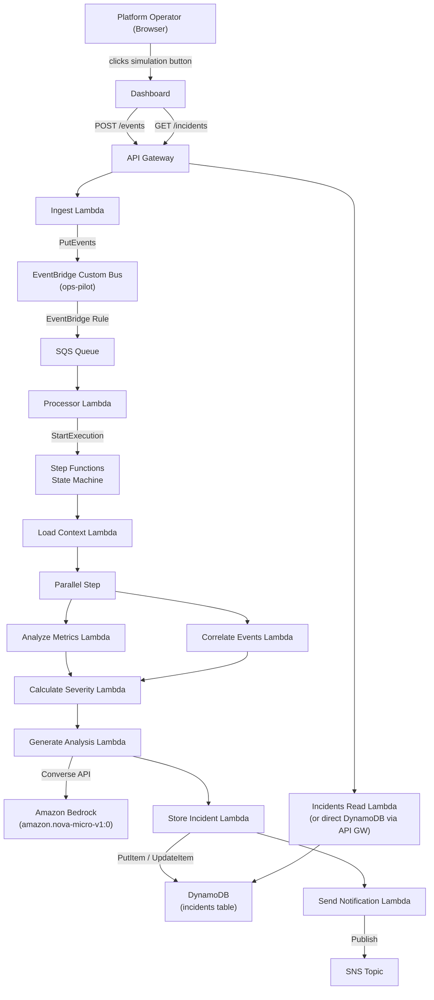

# Design Document: OpsPilot

## Overview

OpsPilot is a serverless, event-driven cloud incident response platform built on AWS. It provides a demonstration-grade pipeline that ingests simulated operational telemetry, routes it through a multi-step AI-assisted analysis workflow, persists structured incident records, and surfaces them on a React dashboard.

The platform is intentionally optimised for a hackathon MVP — every component is AWS-native, all infrastructure is defined in a single SAM template, and correctness of the core logic (severity calculation, incident storage, AI response parsing) is enforced by property-based tests written with fast-check.

### Design Goals

- **Event-driven reliability**: no synchronous coupling between the API surface and the processing pipeline.
- **Observability first**: every step in the workflow emits structured log entries to CloudWatch.
- **Graceful degradation**: AI analysis failures never block the pipeline; a deterministic fallback is always available.
- **Spec-driven correctness**: the most complex business logic (severity calculation, serialization) is specified as universally-quantified properties and validated with property-based tests.

---

## Architecture

### System Context



### Request Flow

1. The user clicks a simulation button on the React dashboard.
2. The dashboard constructs a `TelemetryEvent` matching the selected simulation profile and POSTs it to `POST /events` on API Gateway.
3. **Ingest Lambda** validates the event, generates a UUID `incidentId`, and publishes a custom event to the EventBridge bus.
4. An EventBridge rule routes the event to the **SQS Queue**, which buffers it with a 24-hour retention and 30-second visibility timeout.
5. **Processor Lambda** (SQS trigger) deduplicates by `incidentId` and starts one Step Functions execution per unique event.
6. The **Step Functions workflow** orchestrates the following steps in order:
   - `LoadContext` — enriches the event with baseline metadata
   - Parallel: `AnalyzeMetrics` and `CorrelateEvents` — run concurrently
   - `CalculateSeverity` — computes an integer score 0–100
   - `GenerateAnalysis` — calls Bedrock; falls back to `FallbackAnalysis` on failure
   - `StoreIncident` — upserts the incident record to DynamoDB
   - `SendNotification` — publishes to SNS; always succeeds even if SNS fails
7. The dashboard polls `GET /incidents` and renders the incident list.

---

## Components and Interfaces

### Frontend (React + Vite + TypeScript)

**Location**: `frontend/`

The dashboard is a single-page application that:

- Renders three simulation trigger buttons (`DB Failure`, `CPU Spike`, `Bad Deployment`).
- Disables all buttons while a simulation POST is in-flight.
- Polls `GET /incidents` on load and renders the incident list.
- Derives a system health indicator from the highest active severity score.
- Displays one service card per distinct `service` value and individual incident cards.

**Key modules**:

| Module | Responsibility |
|--------|----------------|
| `SimulationPanel` | Renders trigger buttons, manages in-flight state, calls `POST /events` |
| `payloads.ts` | Exports `buildDbFailurePayload()`, `buildCpuSpikePayload()`, `buildBadDeploymentPayload()` — pure factory functions that return fixed-profile `TelemetryEvent` objects |
| `HealthIndicator` | Derives `"Healthy"` / `"Degraded"` / `"Critical"` from active severity scores |
| `IncidentList` | Renders service cards and incident cards from fetched data |
| `api.ts` | Typed wrappers for `POST /events` and `GET /incidents` |

**Health status derivation rule** (pure function, deterministic):

```
no active incidents           → "Healthy"
highest severity in [1, 49]   → "Degraded"
highest severity in [50, 100] → "Critical"
```

---

### Backend Lambda Functions

All Lambda functions share the following characteristics:
- Runtime: Node.js 22
- Language: TypeScript, compiled with esbuild
- Shared types imported from `backend/shared/types.ts`
- Structured logging to CloudWatch via `console.log` (JSON-formatted)

#### Ingest Lambda (`backend/functions/ingest/`)

**Trigger**: API Gateway `POST /events`

**Interface**:
```
Input:  APIGatewayProxyEvent (body: TelemetryEvent JSON)
Output: APIGatewayProxyResult
  202 { incidentId: string (UUID v4) }   — success
  400 { error: string, missingFields?: string[] }  — validation failure
  502 { error: string }                  — EventBridge publish failure
```

**Behaviour**:
1. Parse and validate the request body as a `TelemetryEvent`. Required fields: `serviceName`, `errorRate`, `p95Latency`, `cpuUsage`, `timestamp`. On missing fields, return 400 with each missing field named.
2. Generate a UUID v4 `incidentId` (`crypto.randomUUID()`).
3. Call `EventBridge.putEvents` with `source: "ops-pilot"`, `detail-type: "IncidentEvent"`, and the full `TelemetryEvent` as `detail`.
4. On success, return 202 `{ incidentId }`.
5. On EventBridge failure, return 502 without persisting partial state.

---

#### Processor Lambda (`backend/functions/processor/`)

**Trigger**: SQS (`incidents-queue`)

**Interface**:
```
Input:  SQSEvent (one or more SQSRecord)
Output: void (throws on failure to prevent SQS deletion)
```

**Behaviour**:
1. For each SQS record, extract the `TelemetryEvent` and `incidentId` from the EventBridge envelope.
2. Check an in-memory or DynamoDB-backed deduplication table (by `incidentId`). If a matching execution already exists, skip. Design note: for MVP, a DynamoDB conditional write or Step Functions `startExecution` with a deterministic execution name (derived from `incidentId`) provides idempotency natively — Step Functions rejects duplicate execution names.
3. Call `StepFunctions.startExecution` with `name: incidentId` (execution names are globally unique per state machine; duplicate attempts return `ExecutionAlreadyExists` which the processor treats as success).
4. If `startExecution` throws (and is not `ExecutionAlreadyExists`), re-throw so SQS does not delete the message.

**Deduplication approach**: Using `incidentId` as the Step Functions execution name is the simplest approach. Step Functions enforces uniqueness within 90 days; for the MVP scope this is sufficient.

---

#### Load Context Lambda (`backend/functions/loadContext/`)

**Trigger**: Step Functions task state

**Interface**:
```
Input:  { incidentId: string, telemetry: TelemetryEvent }
Output: { incidentId: string, telemetry: TelemetryEvent, context: IncidentContext }
```

Enriches the event with `IncidentContext`: service tier, region, baseline thresholds for the service. For MVP, context is a static lookup by `serviceName`.

---

#### Analyze Metrics Lambda (`backend/functions/analyzeMetrics/`)

**Trigger**: Step Functions parallel task state

**Interface**:
```
Input:  { incidentId: string, telemetry: TelemetryEvent, context: IncidentContext }
Output: { metricsAnalysis: MetricsAnalysis }
```

Evaluates `errorRate`, `p95Latency`, and `cpuUsage` against baseline thresholds. Returns a `MetricsAnalysis` object with anomaly flags and numeric deviations.

```typescript
interface MetricsAnalysis {
  errorRateAnomaly: boolean;
  latencyAnomaly: boolean;
  cpuAnomaly: boolean;
  deviations: Record<string, number>; // metric name → % above threshold
}
```

---

#### Correlate Events Lambda (`backend/functions/correlateEvents/`)

**Trigger**: Step Functions parallel task state

**Interface**:
```
Input:  { incidentId: string, telemetry: TelemetryEvent, context: IncidentContext }
Output: { correlationResult: CorrelationResult }
```

Identifies patterns in `errorCodes` and `severityIndicators`. Returns correlated event clusters and a dominant pattern label.

```typescript
interface CorrelationResult {
  dominantPattern: string;   // e.g., "database-timeout", "cpu-saturation"
  relatedErrorCodes: string[];
  patternConfidence: number; // 0.0–1.0
}
```

---

#### Calculate Severity Lambda (`backend/functions/calculateSeverity/`)

**Trigger**: Step Functions task state

**Interface**:
```
Input:  {
  telemetry: TelemetryEvent,
  metricsAnalysis: MetricsAnalysis,
  correlationResult: CorrelationResult
}
Output: { severity: Severity }  // integer 0–100
```

**Severity algorithm** (pure function — no side effects):

1. Start with a base score of 0.
2. Apply `errorRate` contribution: `errorRate * 40` (capped at 40).
3. Apply `p95Latency` contribution: logarithmic scale — `Math.min(20, Math.log10(p95Latency + 1) * 10)`.
4. Apply `cpuUsage` contribution: `cpuUsage * 20` (capped at 20).
5. Sum anomaly flags: +5 per anomaly from `metricsAnalysis` (max 15).
6. Apply critical floor: if `"critical"` is in `severityIndicators`, ensure score ≥ 75.
7. Clamp final result to integer in [0, 100]: `Math.max(0, Math.min(100, Math.round(score)))`.

This algorithm satisfies the monotonicity invariant (steps 2–4 are monotonically non-decreasing in their respective inputs) and the critical floor invariant (step 6 enforces the 75 lower bound).

**Input validation**: Reject and throw if `errorRate` is outside [0.0, 1.0], `p95Latency` is negative, or `severityIndicators` is absent or not an array.

---

#### Generate Analysis Lambda (`backend/functions/generateAnalysis/`)

**Trigger**: Step Functions task state

**Interface**:
```
Input:  { incidentId: string, telemetry: TelemetryEvent, severity: Severity }
Output: { aiAnalysis: AnalysisResult }
```

**Bedrock invocation**:
- Model: `process.env.BEDROCK_MODEL_ID ?? "amazon.nova-micro-v1:0"`. Reject empty string.
- API: Converse API (`bedrock-runtime.converse`).
- Timeout: 30 seconds (Lambda timeout set to 35 seconds).

**Prompt template** (system + user):
```
System: You are an expert cloud operations engineer. Analyse the telemetry event and respond ONLY with a JSON object.

User:
Analyse this incident:
- Service: {serviceName}
- Timestamp: {timestamp}
- Error Rate: {errorRate}
- P95 Latency: {p95Latency}ms
- CPU Usage: {cpuUsage}%
- Severity Indicators: {severityIndicators}
- Error Codes: {errorCodes}

Respond with EXACTLY this JSON structure:
{
  "rootCause": "<1-500 char string>",
  "evidence": ["<item>", ...],  // 1-10 items
  "impact": "<1-300 char string>",
  "remediationSteps": ["<step1>", "<step2>", "<step3>"]  // EXACTLY 3 items
}
```

**Response parsing**: Extract the JSON object from the Bedrock `converse` response content. Validate all four required fields and that `remediationSteps` has exactly three items. On any parse or validation failure, return `FallbackAnalysis`.

**FallbackAnalysis** (deterministic per simulation type, hardcoded):
```typescript
const FALLBACK_ANALYSES: Record<string, AnalysisResult> = {
  "db-failure-service": {
    rootCause: "Database connection pool exhausted due to elevated error rates.",
    evidence: ["High errorRate detected", "Database connection error codes present"],
    impact: "Service unable to process requests requiring database access.",
    remediationSteps: [
      "Restart database connection pool",
      "Check database server health and connectivity",
      "Scale database read replicas if read load is the cause"
    ]
  },
  "cpu-spike-service": { ... },
  "bad-deployment-service": { ... },
  "_default": { ... }  // generic fallback
};
```

---

#### Store Incident Lambda (`backend/functions/storeIncident/`)

**Trigger**: Step Functions task state

**Interface**:
```
Input:  {
  incidentId: string,
  telemetry: TelemetryEvent,
  severity: Severity,
  aiAnalysis: AnalysisResult
}
Output: { incidentId: string, updatedAt: string }
```

**DynamoDB operation**: `PutItem` with a conditional expression to set `createdAt` only when the item does not exist, and always update `updatedAt`. Equivalent to an upsert:

```typescript
// Pseudocode
await dynamodb.put({
  TableName: "incidents",
  Item: {
    incidentId,
    service: telemetry.serviceName,
    status: "active",
    severity,
    telemetry,
    aiAnalysis,
    createdAt: existingCreatedAt ?? now,
    updatedAt: now,
  },
  // For true upsert: use UpdateItem with SET expressions
});
```

**Idempotency**: Use `UpdateItem` with a `SET createdAt = if_not_exists(createdAt, :now)` expression. This guarantees that re-running with the same `incidentId` updates `updatedAt` and other fields but never overwrites `createdAt` or creates a duplicate item.

**Retry**: Implement 3-attempt exponential backoff for DynamoDB throttling errors (400ms → 800ms → 1600ms).

**Validation**: Before calling DynamoDB, verify all eight required fields are present. Throw a descriptive error naming any absent field.

---

#### Send Notification Lambda (`backend/functions/sendNotification/`)

**Trigger**: Step Functions task state

**Interface**:
```
Input:  { incidentId: string, severity: Severity, timestamp: string }
Output: { success: true }  // always
```

**Behaviour** (never fails the workflow):
1. If `SNS_TOPIC_ARN` env var is absent, log a warning and return `{ success: true }`.
2. If `incidentId` or `severity` are absent from input, log an error and return `{ success: true }`.
3. Publish `{ incidentId, severity, timestamp }` to SNS with a 5-second timeout.
4. If SNS publish fails or times out, log the error with `incidentId` and return `{ success: true }`.

---

### Shared Types (`backend/shared/types.ts`)

```typescript
// Branded type: enforces 0-100 at compile time via opaque nominal typing
declare const __brand: unique symbol;
type Brand<T, B> = T & { [__brand]: B };
export type Severity = Brand<number, "Severity">;

export function asSeverity(n: number): Severity {
  if (!Number.isInteger(n) || n < 0 || n > 100) {
    throw new RangeError(`Severity must be an integer in [0, 100], got ${n}`);
  }
  return n as Severity;
}

export interface TelemetryEvent {
  serviceName: string;
  errorRate: number;           // [0.0, 1.0]
  p95Latency: number;          // milliseconds, non-negative
  cpuUsage: number;            // [0.0, 1.0]
  errorCodes: string[];
  deploymentMetadata: Record<string, string | number>;
  timestamp: string;           // ISO 8601
  severityIndicators: string[];
}

export type IncidentStatus = "active" | "investigating" | "resolved";

export interface AnalysisResult {
  rootCause: string;
  evidence: string[];
  impact: string;
  remediationSteps: [string, string, string]; // tuple: exactly 3
}

export interface Incident {
  incidentId: string;
  service: string;
  status: IncidentStatus;
  severity: Severity;
  telemetry: TelemetryEvent;
  aiAnalysis: AnalysisResult;
  createdAt: string;           // ISO 8601
  updatedAt: string;           // ISO 8601
}
```

---

## Data Models

### DynamoDB: `incidents` Table

| Attribute | Type | Notes |
|-----------|------|-------|
| `incidentId` | String (PK) | UUID v4; partition key |
| `service` | String | `telemetry.serviceName` |
| `status` | String | `"active"` \| `"investigating"` \| `"resolved"` |
| `severity` | Number | Integer, [0, 100] |
| `telemetry` | Map | Full `TelemetryEvent` object |
| `aiAnalysis` | Map | Full `AnalysisResult` object |
| `createdAt` | String | ISO 8601 UTC; set on first write only |
| `updatedAt` | String | ISO 8601 UTC; updated on every write |

**Access patterns**:
- `GET /incidents`: `Scan` the table (MVP scope — small dataset). Future: GSI on `status` + `createdAt`.
- `PUT /incidents/{id}`: `UpdateItem` by `incidentId`.

**Capacity mode**: On-demand (PAY_PER_REQUEST) — appropriate for MVP traffic.

### EventBridge Event Envelope

```json
{
  "source": "ops-pilot",
  "detail-type": "IncidentEvent",
  "detail": {
    "incidentId": "uuid-v4",
    "telemetry": { ...TelemetryEvent }
  }
}
```

### Step Functions Input/Output Shape

Each step passes forward the accumulated state. The state machine input is:

```json
{
  "incidentId": "uuid-v4",
  "telemetry": { ...TelemetryEvent }
}
```

After each step, the state is enriched:

```
After LoadContext:       + { context: IncidentContext }
After Parallel:          + { metricsAnalysis: MetricsAnalysis, correlationResult: CorrelationResult }
After CalculateSeverity: + { severity: 0-100 }
After GenerateAnalysis:  + { aiAnalysis: AnalysisResult }
After StoreIncident:     + { updatedAt: ISO8601 }
```

### SAM Template Structure

```
template.yaml
├── Parameters
│   ├── BedrockModelId (default: amazon.nova-micro-v1:0)
│   └── AWSRegion (default: us-east-1)
├── Globals
│   └── Function: Runtime=nodejs22.x, Architectures=[x86_64]
├── Resources
│   ├── IncidentsApi (AWS::Serverless::Api)
│   ├── EventBus (AWS::Events::EventBus)
│   ├── EventRule (AWS::Events::Rule → SQS)
│   ├── IncidentsQueue (AWS::SQS::Queue) + DLQ
│   ├── IncidentsTable (AWS::DynamoDB::Table)
│   ├── IncidentsTopic (AWS::SNS::Topic)
│   ├── IngestFunction (AWS::Serverless::Function)
│   ├── ProcessorFunction (AWS::Serverless::Function)
│   ├── LoadContextFunction (AWS::Serverless::Function)
│   ├── AnalyzeMetricsFunction (AWS::Serverless::Function)
│   ├── CorrelateEventsFunction (AWS::Serverless::Function)
│   ├── CalculateSeverityFunction (AWS::Serverless::Function)
│   ├── GenerateAnalysisFunction (AWS::Serverless::Function)
│   ├── StoreIncidentFunction (AWS::Serverless::Function)
│   ├── SendNotificationFunction (AWS::Serverless::Function)
│   └── IncidentWorkflow (AWS::Serverless::StateMachine)
└── Outputs
    ├── ApiEndpoint
    ├── IncidentsTableName
    └── StateMachineArn
```

---

## Correctness Properties

*A property is a characteristic or behavior that should hold true across all valid executions of a system — essentially, a formal statement about what the system should do. Properties serve as the bridge between human-readable specifications and machine-verifiable correctness guarantees.*

### Property 1: Severity range invariant

*For any* valid `TelemetryEvent` where `errorRate` is in [0.0, 1.0], `p95Latency` is a non-negative number, and `severityIndicators` is an array of zero or more non-empty strings, `calculateSeverity` SHALL produce an integer value in the closed range [0, 100].

**Validates: Requirements 3.4, 10.1**

---

### Property 2: Severity monotonicity

*For any* pair of valid `TelemetryEvent` inputs A and B that are identical except that B's `errorRate` is strictly greater than A's `errorRate`, `calculateSeverity(B)` SHALL be greater than or equal to `calculateSeverity(A)`.

**Validates: Requirements 3.5, 10.2**

---

### Property 3: Severity critical floor

*For any* valid `TelemetryEvent` where `severityIndicators` contains the string `"critical"`, `calculateSeverity` SHALL produce a value of 75 or higher, regardless of the values of all other fields.

**Validates: Requirements 3.6, 10.3**

---

### Property 4: Severity idempotence

*For any* valid `TelemetryEvent` input, calling `calculateSeverity` two or more times with the identical input SHALL produce the same integer result on every invocation.

**Validates: Requirements 10.4**

---

### Property 5: Severity input rejection

*For any* `TelemetryEvent` where `errorRate` is outside [0.0, 1.0], `p95Latency` is negative, or `severityIndicators` is absent or not an array, `calculateSeverity` SHALL throw an error without producing a `Severity` value.

**Validates: Requirements 10.6**

---

### Property 6: AnalysisResult serialization round-trip

*For any* valid `AnalysisResult` object, serializing it to its JSON wire format and then deserializing the result SHALL produce an `AnalysisResult` where `rootCause`, `impact`, each element of `remediationSteps`, and each element of `evidence` are byte-for-byte identical to the originals.

**Validates: Requirements 4.6**

---

### Property 7: Ingest validation completeness

*For any* non-empty subset of the required `TelemetryEvent` fields (`serviceName`, `errorRate`, `p95Latency`, `cpuUsage`, `timestamp`) that are removed from an otherwise-valid request body, the Ingest Lambda SHALL return HTTP 400 and the response body SHALL name each and every removed field.

**Validates: Requirements 2.2**

---

### Property 8: Ingest UUID generation

*For any* valid `TelemetryEvent` submitted to the Ingest Lambda, the HTTP 202 response SHALL contain an `incidentId` that matches the UUID v4 format (`/^[0-9a-f]{8}-[0-9a-f]{4}-4[0-9a-f]{3}-[89ab][0-9a-f]{3}-[0-9a-f]{12}$/i`).

**Validates: Requirements 2.4**

---

### Property 9: Processor deduplication

*For any* `incidentId`, sending two SQS messages with the same `incidentId` to the Processor Lambda SHALL result in exactly one Step Functions execution being started for that `incidentId`.

**Validates: Requirements 3.1, 10.5**

---

### Property 10: Incident storage completeness

*For any* valid `Incident` input, the `StoreIncident` Lambda SHALL invoke DynamoDB with an item containing all eight required fields: `incidentId`, `service`, `status`, `severity`, `telemetry`, `aiAnalysis`, `createdAt`, and `updatedAt`.

**Validates: Requirements 5.1, 5.2**

---

### Property 11: Incident storage field-rejection

*For any* non-empty subset of required `Incident` fields that are absent from the input, the `StoreIncident` Lambda SHALL throw an error naming the absent fields and SHALL NOT call DynamoDB.

**Validates: Requirements 5.7**

---

### Property 12: Incident upsert idempotency

*For any* `incidentId`, calling `StoreIncident` two or more times with the same `incidentId` SHALL result in exactly one DynamoDB item for that key and SHALL NOT create a second distinct record.

**Validates: Requirements 5.4, 10.5**

---

### Property 13: Bedrock prompt field inclusion

*For any* valid `TelemetryEvent`, when `GenerateAnalysis` constructs the Bedrock prompt, the prompt string SHALL contain the values of `serviceName`, `timestamp`, `errorRate`, `p95Latency`, `cpuUsage`, `severityIndicators`, and `errorCodes` from the input event.

**Validates: Requirements 4.1**

---

### Property 14: Dashboard health status derivation

*For any* list of active incident severity scores, the health status derivation function SHALL return `"Healthy"` when the list is empty, `"Degraded"` when the maximum score is in [1, 49], and `"Critical"` when the maximum score is 50 or above.

**Validates: Requirements 7.1**

---

### Property 15: SNS message field completeness

*For any* valid notification input containing `incidentId`, `severity`, and `timestamp`, the `SendNotification` Lambda SHALL publish an SNS message whose payload contains all three fields with their original values.

**Validates: Requirements 6.1**

---

## Error Handling

### Ingest Lambda

| Condition | Behaviour |
|-----------|-----------|
| Missing required fields | HTTP 400 with named missing fields |
| Non-JSON body | HTTP 400 with parse error message |
| EventBridge `PutEvents` failure | HTTP 502; no partial state persisted |
| Unexpected runtime error | HTTP 500; structured error log to CloudWatch |

### Processor Lambda

| Condition | Behaviour |
|-----------|-----------|
| `ExecutionAlreadyExists` from Step Functions | Treat as success; delete message from SQS |
| Step Functions `StartExecution` failure | Re-throw; SQS retains message for reprocessing |
| Message exceeds SQS max receive count | Moved to DLQ; emits CloudWatch alarm |

### Step Functions Workflow

Each Lambda task state in the workflow is configured with a `Retry` block:
- `MaxAttempts: 3`
- `IntervalSeconds: 2`
- `BackoffRate: 2.0`
- `ErrorEquals: ["Lambda.ServiceException", "Lambda.AWSLambdaException", "Lambda.SdkClientException", "States.TaskFailed"]`

After 3 failed attempts, the execution transitions to a `Fail` state, emitting an error log entry containing the failed step name and `incidentId`.

### Calculate Severity Lambda

| Condition | Behaviour |
|-----------|-----------|
| Invalid `errorRate` (outside [0,1]) | Throw `InvalidInputError` with field name |
| Negative `p95Latency` | Throw `InvalidInputError` with field name |
| `severityIndicators` absent or non-array | Throw `InvalidInputError` with field name |

### Generate Analysis Lambda

| Condition | Behaviour |
|-----------|-----------|
| `BEDROCK_MODEL_ID` is empty string | Throw before invoking Bedrock |
| Bedrock API error | Return `FallbackAnalysis`; log error with `incidentId` |
| Bedrock timeout (>30s) | Return `FallbackAnalysis`; log timeout with `incidentId` |
| Response missing required fields | Return `FallbackAnalysis`; log parse error |
| `remediationSteps` !== 3 items | Return `FallbackAnalysis`; log validation failure |

### Store Incident Lambda

| Condition | Behaviour |
|-----------|-----------|
| Missing required Incident field | Throw descriptive error; DynamoDB not called |
| DynamoDB throttle / transient error | Retry 3× with exponential backoff (400ms, 800ms, 1600ms) |
| DynamoDB failure after 3 retries | Propagate error to Step Functions (triggers workflow retry) |

### Send Notification Lambda

| Condition | Behaviour |
|-----------|-----------|
| `SNS_TOPIC_ARN` absent | Log warning; return `{ success: true }` |
| `incidentId` or `severity` absent | Log error; return `{ success: true }` |
| SNS publish error or timeout | Log error with `incidentId`; return `{ success: true }` |

The `SendNotification` Lambda is designed to be a best-effort notifier. It must never fail the workflow.

### Frontend Error Handling

| Condition | Behaviour |
|-----------|-----------|
| `POST /events` network error | Display error banner; re-enable all simulation buttons |
| `POST /events` non-2xx response | Display error banner with status code; re-enable buttons |
| `GET /incidents` failure or timeout | Display error message; preserve any previously rendered data |
| `GET /incidents` takes >5s | Display timeout error; preserve previous data |

---

## Testing Strategy

### Dual Testing Approach

OpsPilot uses two complementary test layers:

1. **Property-based tests** (fast-check) — validate universal invariants across randomised inputs for the core logic modules.
2. **Unit tests** (Jest) — validate specific examples, error paths, and integration points.

### Property-Based Testing with fast-check

**Library**: `fast-check` (TypeScript-native, no additional setup required).

**Configuration**: Each property test runs a minimum of 100 iterations. Tests are tagged with a comment referencing the design property they validate.

**Tag format**: `// Feature: ops-pilot, Property N: <property_text>`

**Location**: `tests/property/`

**Properties to implement**:

| File | Property | Design Ref |
|------|----------|------------|
| `tests/property/calculateSeverity.property.test.ts` | Range invariant | Property 1 |
| `tests/property/calculateSeverity.property.test.ts` | Monotonicity | Property 2 |
| `tests/property/calculateSeverity.property.test.ts` | Critical floor | Property 3 |
| `tests/property/calculateSeverity.property.test.ts` | Idempotence | Property 4 |
| `tests/property/calculateSeverity.property.test.ts` | Input rejection | Property 5 |
| `tests/property/analysisResult.property.test.ts` | Serialization round-trip | Property 6 |
| `tests/property/ingest.property.test.ts` | Validation completeness | Property 7 |
| `tests/property/ingest.property.test.ts` | UUID generation | Property 8 |
| `tests/property/processor.property.test.ts` | Deduplication | Property 9 |
| `tests/property/storeIncident.property.test.ts` | Storage completeness | Property 10 |
| `tests/property/storeIncident.property.test.ts` | Field rejection | Property 11 |
| `tests/property/storeIncident.property.test.ts` | Upsert idempotency | Property 12 |
| `tests/property/generateAnalysis.property.test.ts` | Prompt field inclusion | Property 13 |
| `tests/property/dashboard.property.test.ts` | Health status derivation | Property 14 |
| `tests/property/sendNotification.property.test.ts` | SNS message fields | Property 15 |

**fast-check arbitraries** for the severity module:

```typescript
// Valid TelemetryEvent arbitrary
const validTelemetryEvent = fc.record({
  serviceName: fc.string({ minLength: 1 }),
  errorRate: fc.float({ min: 0, max: 1, noNaN: true }),
  p95Latency: fc.float({ min: 0, max: 60000, noNaN: true }),
  cpuUsage: fc.float({ min: 0, max: 1, noNaN: true }),
  errorCodes: fc.array(fc.string()),
  deploymentMetadata: fc.dictionary(fc.string(), fc.oneof(fc.string(), fc.integer())),
  timestamp: fc.date().map(d => d.toISOString()),
  severityIndicators: fc.array(fc.string({ minLength: 1 })),
});

// With "critical" forced into severityIndicators
const criticalTelemetryEvent = validTelemetryEvent.map(e => ({
  ...e,
  severityIndicators: [...e.severityIndicators, "critical"],
}));
```

### Unit Tests (Jest)

**Location**: `tests/unit/`

**Coverage targets** (unit + property combined):
- Lambda functions: 80%+ line coverage
- Shared types / utility functions: 100%

**Key unit test scenarios**:

| File | Scenarios |
|------|-----------|
| `tests/unit/ingest.test.ts` | Valid payload → 202; non-JSON → 400; EventBridge failure → 502 |
| `tests/unit/processor.test.ts` | ExecutionAlreadyExists treated as success; SFN failure re-throws |
| `tests/unit/generateAnalysis.test.ts` | Empty BEDROCK_MODEL_ID → error; Bedrock error → FallbackAnalysis; Bedrock timeout → FallbackAnalysis; missing remediationSteps → FallbackAnalysis |
| `tests/unit/storeIncident.test.ts` | New incident → PutItem; existing incidentId → UpdateItem; DynamoDB retries on throttle |
| `tests/unit/sendNotification.test.ts` | Missing SNS_TOPIC_ARN → skip + warn; missing fields → skip + error log; SNS error → success response |
| `tests/unit/payloads.test.ts` | DB Failure payload constraints; CPU Spike payload constraints; Bad Deployment timestamp |
| `tests/unit/healthStatus.test.ts` | Empty → Healthy; severity 25 → Degraded; severity 75 → Critical |

### Infrastructure Tests

**SAM template validation**: `sam validate` as a CI step.

**Snapshot tests**: For SAM/CloudFormation output, assert the synthesized template matches expected resource definitions for IAM policies, SQS configuration, and EventBridge rules.

Specific checks:
- `IncidentsQueue.VisibilityTimeout >= 30` seconds
- `IncidentsQueue.MessageRetentionPeriod >= 86400` seconds (24 hours)
- `GenerateAnalysisFunction` has `bedrock:InvokeModel` in its IAM policy
- `EventRule` targets `IncidentsQueue` ARN
- All Lambda functions use `nodejs22.x` runtime

### TypeScript Compilation

The TypeScript compiler (`tsc --noEmit`) serves as the primary check for all Requirement 9 acceptance criteria (shared types correctness). This runs as part of the build step before any tests execute.

### CI Pipeline Order

```
tsc --noEmit          → type correctness (Requirement 9)
sam validate          → template correctness (Requirement 8)
jest tests/unit       → example-based unit tests
jest tests/property   → property-based tests (min 100 iterations each)
sam build             → build verification
```
